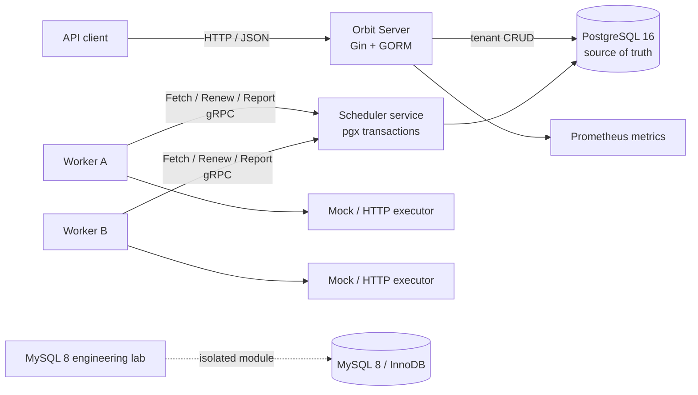

# Orbit Scheduler

[](https://github.com/mrussss/orbit-scheduler/actions/workflows/ci.yml)

Orbit Scheduler is a Go and PostgreSQL distributed task execution platform. It
demonstrates atomic task claiming, lease fencing, idempotent APIs, bounded
workers, secure HTTP execution, and graceful shutdown with reproducible
integration evidence.

PostgreSQL is the only production source of truth. The repository also contains
an isolated MySQL 8 engineering lab for index, isolation, deadlock, idempotency,
and `SKIP LOCKED` experiments; it is not a second production backend.

## Why this project exists

A reliable scheduler needs more than a queue and a goroutine pool. Orbit is
built around the failure cases that make distributed execution difficult:

- two workers trying to claim the same task;
- a worker disappearing after a claim commits;
- a lease expiring while an old attempt is still running;
- a result commit succeeding while its response is lost;
- cancellation, completion, and lease reaping racing;
- shutdown beginning while work and result reporting are in flight.

Orbit provides **at-least-once execution**. A task may run more than once, but
lease ownership and a monotonic attempt number prevent an expired attempt from
overwriting the current result. Terminal task states never regress.

## Architecture



Management queries use GORM, while scheduling transitions use pgx and explicit
SQL transactions. The two transaction mechanisms are never mixed in one unit
of work.

The complete component and transaction diagrams are in
[`docs/architecture.md`](docs/architecture.md).

## Delivered capabilities

### Scheduler correctness

- PostgreSQL `FOR UPDATE SKIP LOCKED` task claiming with stable ordering.
- Worker capacity and project-level concurrency quotas enforced in the claim
  transaction.
- Task, Attempt, Lease, Outbox, worker count, and project count updates committed
  atomically.
- Lease renewal and result reporting fenced by task ID, worker instance ID,
  attempt number, state, and lease validity.
- Idempotent result replay for the same outcome and result hash; conflicting or
  stale results are rejected.
- Lease reaping, bounded retry backoff, and conditional cancellation without
  terminal-state regression.

### HTTP and business API

- Project, scoped API Token, Job, Task, Attempt, Result, and Cancel endpoints.
- Tenant isolation and `task:*`, `job:*`, and `project:admin` scopes.
- HMAC-SHA256 token storage, idempotency keys, and signed cursor pagination.
- Request ID, trace ID, recovery, timeout, body limit, CORS, health, and HTTP
  Prometheus metrics.

### Worker runtime and executors

- Register → Heartbeat → Fetch → Execute → Renew → Report lifecycle.
- Bounded concurrency, independent task contexts, execution deadlines, and
  bounded report retries.
- Draining and graceful shutdown with a finite grace period and client cleanup.
- Deterministic fault-capable Mock executor.
- Allowlisted HTTP executor with scheme, DNS, resolved-IP, redirect, dial-path,
  header, body, response, and proxy restrictions.

### Reproducible evidence

- PostgreSQL Testcontainers integration tests for atomic claims, capacity,
  rollback, idempotency, fencing, and reaping.
- A black-box smoke test that starts an empty PostgreSQL container, server, and
  two independent workers, then creates and completes a task through the real
  HTTP and gRPC paths.
- Race Detector, build, PostgreSQL integration, smoke, and isolated MySQL jobs
  in GitHub Actions.
- Recorded PostgreSQL and MySQL query-plan evidence without production
  performance claims.

## One-command demo

Requirements: Docker, Go 1.22+, and `curl`. Docker must be running.

```bash
make demo
```

The demo is isolated from local data. It builds the binaries, starts a temporary
PostgreSQL 16 container, applies every migration, starts the server and two
workers, creates credentials and a delayed task through HTTP, verifies lease
renewal and the final result, sends SIGTERM, requires both workers to exit
cleanly, and removes its temporary resources.

A successful run ends with output similar to:

```text
phase5 smoke passed project_id=... task_id=... status=SUCCEEDED attempts=1 workers=2
Orbit demo completed successfully.
```

## Manual local run

```bash
cp .env.example .env
make compose-up
set -a; . ./.env; set +a
make migrate-up
make run-server
```

Start a worker in another terminal after loading the same `.env`:

```bash
go run ./cmd/orbit-worker
```

Endpoints:

- API: `http://localhost:8080`
- gRPC: `localhost:9090`
- liveness: `http://localhost:8080/health/live`
- readiness: `http://localhost:8080/health/ready`
- metrics: `http://localhost:9091/metrics`
- Prometheus UI: `http://localhost:9095`

`ADMIN_TOKEN` creates Projects. A Project Token is returned only when created
and carries the scopes supplied in the request.

## Verification

```bash
make lint                    # go vet + formatting
make test-race               # unit tests under the Race Detector
make build                   # all root cmd binaries
make test-integration        # real PostgreSQL Testcontainers tests
make smoke-phase5            # black-box HTTP → gRPC → Worker flow
make test-mysql-lab          # complete isolated MySQL 8 lab
make test-mysql-concurrency  # repeated deadlock/claim/idempotency tests
make verify                  # complete release verification
```

The MySQL tests use real InnoDB through Testcontainers and can take several
minutes. They never import a MySQL driver into Orbit's production binaries.

## MySQL 8 engineering lab

The lab lives in `experiments/mysql8` as an independent Go module and covers:

- versioned migrations and `BINARY(16)` UUIDs;
- GORM CRUD and native `database/sql` transactions;
- deterministic 100,000-row datasets;
- Offset versus Cursor pagination;
- single-column, incorrectly ordered composite, correct composite, and covering
  indexes with real `EXPLAIN ANALYZE` output;
- READ COMMITTED, REPEATABLE READ, and locking current reads;
- deterministic deadlock reproduction and bounded error-1213 retry;
- concurrent `FOR UPDATE SKIP LOCKED` claiming;
- unique-constraint idempotent creation.

See [`docs/mysql8-engineering-lab.md`](docs/mysql8-engineering-lab.md) and
[`docs/mysql-vs-postgresql.md`](docs/mysql-vs-postgresql.md).

## Explicit boundaries

- Kafka relay, audit consumption, and DLQ semantics are **not implemented**.
  Transactional outbox rows are written, but the relay and consumer commands
  remain reserved entry-point scaffolds.
- Worker gRPC currently uses plaintext transport without application
  authentication and must remain on a trusted private network. Internet
  exposure requires authenticated TLS or mTLS.
- HTTP executor application checks complement, but do not replace, egress
  firewalling and cloud metadata protections.
- The recorded timings are local experiment evidence, not production latency,
  throughput, availability, or exactly-once claims.

## Documentation

- [Architecture and transaction flows](docs/architecture.md)
- [Execution semantics](docs/execution-semantics.md)
- [Task state machine](docs/state-machine.md)
- [Business API and querying](docs/business-api-and-querying.md)
- [Failure and shutdown cases](docs/failure-cases.md)
- [PostgreSQL query plans](docs/query-plans.md)
- [Phase 5 validation record](docs/job-ready-validation.md)
- [Resume wording and interview checklist](docs/resume-and-interview.md)

## Repository status

This repository is intentionally feature-frozen at the Phase 5 production
scope plus the isolated MySQL 8 lab. Future Kafka, full observability, and broad
load/fault phases are documented as possible extensions, not delivered claims.
