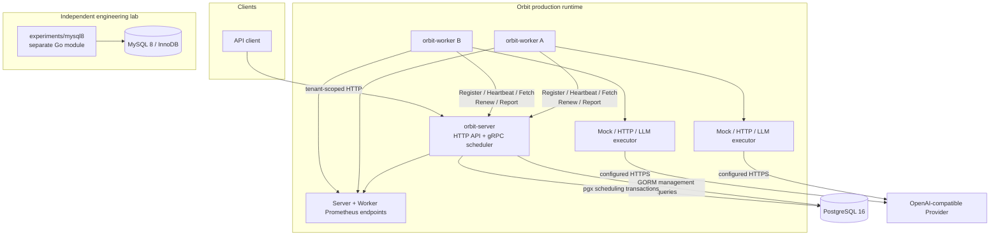
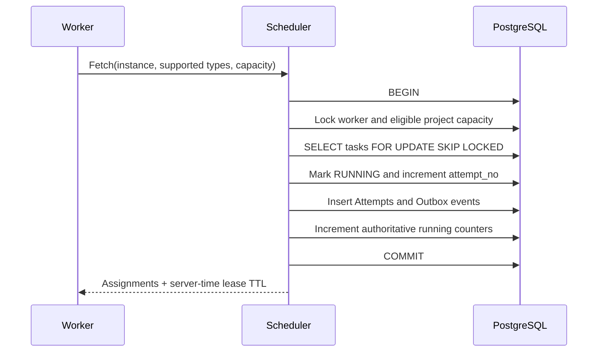
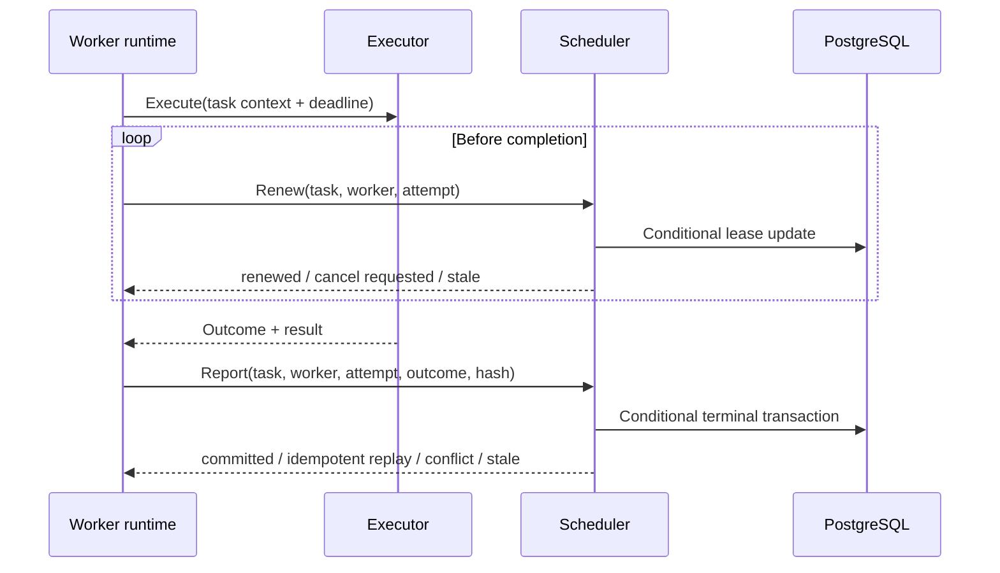
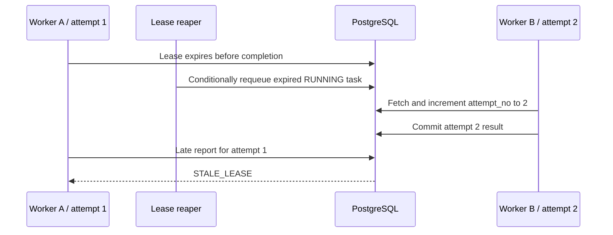
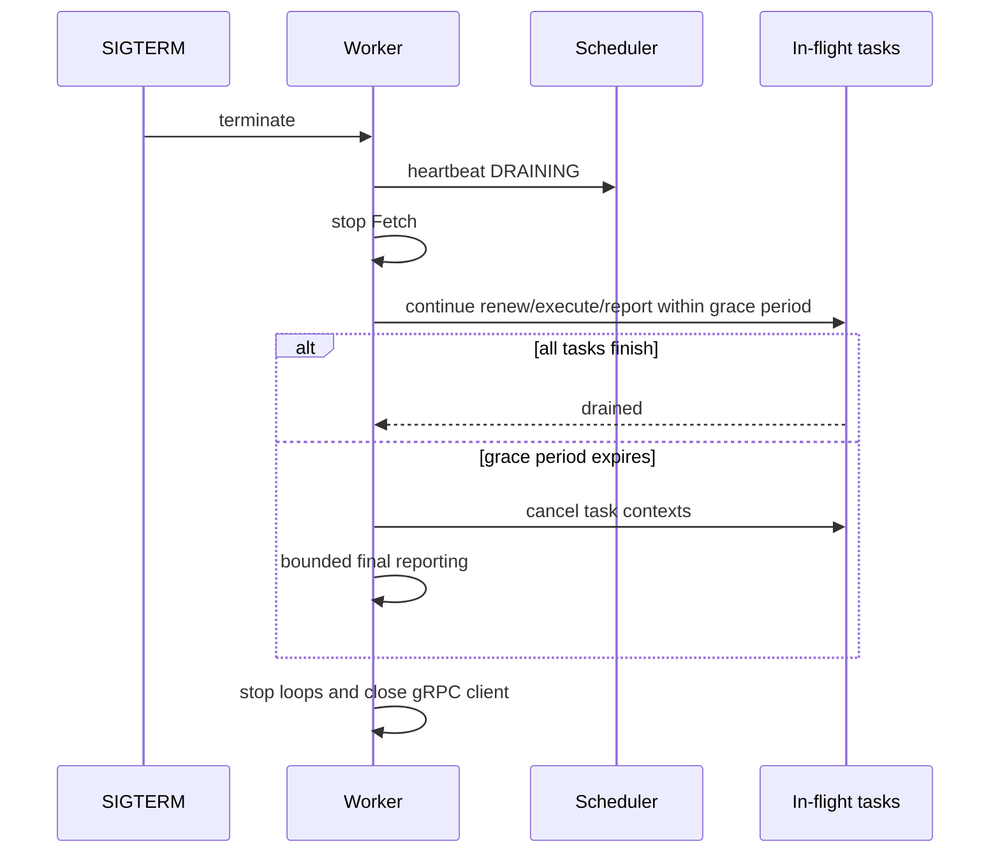

# Architecture

## Component boundary

PostgreSQL is the sole production authority. The MySQL module shares neither a
driver nor a repository abstraction with the production binaries. Kafka relay
and consumer entry points are scaffolds and are not part of the delivered data
flow.

The LLM Provider is an external execution dependency, never a state authority.
It cannot read or modify Scheduler storage. LLM requests remain inside the
Worker's existing capacity, lease, deadline, cancellation, and report flow.

## Data-access split

- Gin application services and GORM repositories handle tenant-scoped Project,
  Token, Job, Task, Attempt, and Result queries.
- pgx stores own state transitions, leases, fencing, capacity, idempotency, and
  transactional outbox writes.
- A business operation never mixes a GORM transaction and a pgx transaction.
- PostgreSQL database constraints remain the final concurrency boundary.

## Atomic fetch transaction

If any Task, Attempt, Outbox, worker-count, or project-count write fails, the
whole transaction rolls back. Candidate ordering is stable by priority,
availability, and task ID.

## Execute, renew, and report

`worker_instance_id + attempt_no` is the fencing identity. A worker that loses
its lease cancels local execution and cannot commit over a newer attempt.

## Lease expiry and recovery

This is why Orbit claims at-least-once execution rather than exactly-once
execution: the original side effect may have occurred even when its lease or
response was lost.

## Graceful shutdown

